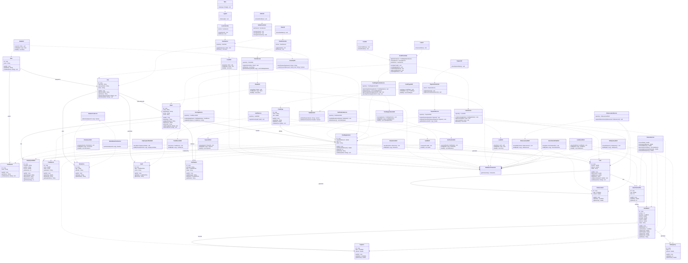

# Class Diagram

Full system class diagram, organized by architectural layer, based on
the preliminary analysis and architecture defined for LEANDCORE.

```mermaid
classDiagram

    %% ===== MODEL LAYER =====

    class User {
        -id : Long
        -username : String
        -passwordHash : String
        -status : String
        +getId() Long
        +getUsername() String
        +getStatus() String
        +setUsername(username: String) void
        +setStatus(status: String) void
    }

    class Role {
        -id : Long
        -name : String
        +getId() Long
        +getName() String
        +setName(name: String) void
    }

    class Permission {
        -id : Long
        -name : String
        +getId() Long
        +getName() String
        +setName(name: String) void
    }

    class Client {
        -id : Long
        -name : String
        -identification : String
        -phone : String
        -email : String
        +getId() Long
        +getName() String
        +getIdentification() String
        +getPhone() String
        +getEmail() String
        +setPhone(phone: String) void
        +setEmail(email: String) void
    }

    class EmploymentData {
        -id : Long
        -company : String
        -position : String
        -income : double
        -jobSeniority : int
        +getId() Long
        +getCompany() String
        +getPosition() String
        +getIncome() double
        +getJobSeniority() int
    }

    class CreditApplication {
        -id : Long
        -requestedAmount : double
        -term : int
        -status : String
        +getId() Long
        +getRequestedAmount() double
        +getTerm() int
        +getStatus() String
        +setStatus(status: String) void
    }

    class CreditScore {
        -id : Long
        -score : double
        -result : String
        -explanation : String
        +getId() Long
        +getScore() double
        +getResult() String
        +getExplanation() String
    }

    class CreditType {
        -id : Long
        -name : String
        -rate : double
        +getId() Long
        +getName() String
        +getRate() double
        +setRate(rate: double) void
    }

    class Loan {
        -id : Long
        -amount : double
        -balance : double
        -status : String
        +getId() Long
        +getAmount() double
        +getBalance() double
        +getStatus() String
        +setBalance(balance: double) void
        +setStatus(status: String) void
    }

    class AmortizationPlan {
        -id : Long
        -rate : double
        -term : int
        +getId() Long
        +getRate() double
        +getTerm() int
    }

    class Installment {
        -id : Long
        -number : int
        -dueDate : LocalDate
        -amount : double
        -principal : double
        -interest : double
        -balance : double
        -status : String
        +getId() Long
        +getNumber() int
        +getDueDate() LocalDate
        +getAmount() double
        +getPrincipal() double
        +getInterest() double
        +getBalance() double
        +getStatus() String
    }

    class Payment {
        -id : Long
        -date : LocalDate
        -amount : double
        +getId() Long
        +getDate() LocalDate
        +getAmount() double
    }

    class Disbursement {
        -id : Long
        -date : LocalDate
        -amount : double
        +getId() Long
        +getDate() LocalDate
        +getAmount() double
    }

    class Delinquency {
        -id : Long
        -days : int
        -amount : double
        +getId() Long
        +getDays() int
        +getAmount() double
    }

    class Biometrics {
        -id : Long
        -type : String
        -identifier : String
        +getId() Long
        +getType() String
        +getIdentifier() String
    }

    class Audit {
        -id : Long
        -date : LocalDateTime
        -action : String
        +getId() Long
        +getDate() LocalDateTime
        +getAction() String
    }

    class Notification {
        -id : Long
        -message : String
        -date : LocalDateTime
        -status : String
        +getId() Long
        +getMessage() String
        +getDate() LocalDateTime
        +getStatus() String
    }

    %% ===== PERSISTENCE LAYER =====

    class UserDAO {
        +save(user: User) void
        +findById(id: Long) User
        +findAll() List~User~
    }

    class RoleDAO {
        +save(role: Role) void
        +findById(id: Long) Role
        +findAll() List~Role~
    }

    class PermissionDAO {
        +save(permission: Permission) void
        +findById(id: Long) Permission
        +findAll() List~Permission~
    }

    class ClientDAO {
        +save(client: Client) void
        +findById(id: Long) Client
        +findAll() List~Client~
    }

    class EmploymentDataDAO {
        +save(data: EmploymentData) void
        +findByClientId(clientId: Long) EmploymentData
    }

    class CreditApplicationDAO {
        +save(application: CreditApplication) void
        +findById(id: Long) CreditApplication
        +findAll() List~CreditApplication~
    }

    class CreditScoreDAO {
        +save(score: CreditScore) void
        +findById(id: Long) CreditScore
    }

    class CreditTypeDAO {
        +save(type: CreditType) void
        +findById(id: Long) CreditType
        +findAll() List~CreditType~
    }

    class LoanDAO {
        +save(loan: Loan) void
        +findById(id: Long) Loan
        +findAll() List~Loan~
    }

    class AmortizationPlanDAO {
        +save(plan: AmortizationPlan) void
        +findById(id: Long) AmortizationPlan
    }

    class InstallmentDAO {
        +save(installment: Installment) void
        +findById(id: Long) Installment
        +findAll() List~Installment~
    }

    class PaymentDAO {
        +save(payment: Payment) void
        +findById(id: Long) Payment
        +findAll() List~Payment~
    }

    class DisbursementDAO {
        +save(disbursement: Disbursement) void
        +findById(id: Long) Disbursement
    }

    class DelinquencyDAO {
        +save(delinquency: Delinquency) void
        +findById(id: Long) Delinquency
    }

    class BiometricsDAO {
        +save(biometrics: Biometrics) void
        +findById(id: Long) Biometrics
    }

    class AuditDAO {
        +save(audit: Audit) void
        +findAll() List~Audit~
    }

    class NotificationDAO {
        +save(notification: Notification) void
        +findById(id: Long) Notification
        +findAll() List~Notification~
    }

    %% ===== SERVICE LAYER =====

    class UserService {
        -repository : UserDAO
        +registerUser(user: User) void
        +listUsers() List~User~
    }

    class ClientService {
        -repository : ClientDAO
        +registerClient(client: Client) void
        +listClients() List~Client~
        +getClientHistory(clientId: Long) List~CreditApplication~
    }

    class CreditApplicationService {
        -repository : CreditApplicationDAO
        +registerApplication(application: CreditApplication) void
        +listApplications() List~CreditApplication~
        +approveApplication(applicationId: Long) void
        +rejectApplication(applicationId: Long) void
    }

    class ScoringService {
        -repository : CreditScoreDAO
        +evaluate(application: CreditApplication) CreditScore
        +explainScore(score: CreditScore) String
    }

    class FinanceService {
        +convertRate() double
        +calculateInstallment() double
        +calculateBalance() double
        +generateAmortization() List~Installment~
        +calculateExtraordinaryPayment() double
        +calculateDelinquency() double
    }

    class LoanService {
        -repository : LoanDAO
        +createLoan(application: CreditApplication) Loan
        +approveLoan(loan: Loan) void
        +rejectLoan(loan: Loan) void
        +listLoans() List~Loan~
    }

    class PaymentService {
        -repository : PaymentDAO
        +registerPayment(payment: Payment) void
        +registerExtraordinaryPayment(payment: Payment) void
        +updateBalance(loanId: Long) double
    }

    class DisbursementService {
        -repository : DisbursementDAO
        +registerDisbursement(disbursement: Disbursement) void
    }

    class BiometricsService {
        +authenticate(userId: Long) boolean
    }

    class MockBiometricsService {
        +authenticate(userId: Long) boolean
    }

    class AuditService {
        -repository : AuditDAO
        +registerEvent(audit: Audit) void
    }

    class NotificationService {
        -repository : NotificationDAO
        +sendNotification(notification: Notification) void
        +listNotifications() List~Notification~
    }

    %% ===== CONTROLLER LAYER =====

    class UserController {
        -service : UserService
        +registerUser() void
        +listUsers() void
    }

    class ClientController {
        -service : ClientService
        +registerClient() void
        +listClients() void
    }

    class CreditController {
        -applicationService : CreditApplicationService
        -scoringService : ScoringService
        -loanService : LoanService
        +simulateCredit() void
        +createApplication() void
        +evaluateApplication() void
        +approveApplication() void
        +rejectApplication() void
    }

    class PaymentController {
        -service : PaymentService
        +registerPayment() void
        +registerExtraordinaryPayment() void
    }

    class AdminController {
        -userService : UserService
        +manageUsers() void
        +manageRoles() void
        +managePermissions() void
    }

    %% ===== UI LAYER =====

    class Main {
        +main(args: String[]) void
    }

    class LoginUI {
        +showLogin() void
    }

    class ClientUI {
        +showClientMenu() void
    }

    class CreditUI {
        +showCreditMenu() void
        +showSimulator() void
    }

    class LoanUI {
        +showLoanMenu() void
    }

    class PaymentUI {
        +showPaymentMenu() void
    }

    class AdminUI {
        +showAdminMenu() void
    }

    %% ===== UTIL LAYER =====

    class DatabaseConnection {
        +getConnection() Connection
    }

    class ValidationUtil {
        +validateRequired(value: String) boolean
        +validateAmount(amount: double) boolean
    }

    class SecurityUtil {
        +hashPassword(password: String) String
        +verifyPassword(password: String, hash: String) boolean
    }

    %% ===== MODEL ASSOCIATIONS =====

    Role "1" --> "0..*" User : assigned to
    Role "1" --> "0..*" Permission : grants

    User "1" --> "0..1" Client : associated with
    User "1" --> "0..1" Biometrics : uses
    User "1" --> "0..*" Audit : generates

    Client "1" --> "0..1" EmploymentData : has
    Client "1" --> "0..*" CreditApplication : submits
    Client "1" --> "0..*" Notification : receives

    CreditType "1" --> "0..*" CreditApplication : defines

    CreditApplication "1" --> "0..1" CreditScore : evaluated by
    CreditApplication "1" --> "0..1" Loan : generates

    Loan "1" --> "1" AmortizationPlan : has
    AmortizationPlan "1" --> "1..*" Installment : contains

    Installment "1" --> "0..*" Payment : receives
    Installment "1" --> "0..1" Delinquency : generates

    Loan "1" --> "0..1" Disbursement : generates

    %% ===== PERSISTENCE DEPENDENCIES =====

    UserDAO ..> User
    RoleDAO ..> Role
    PermissionDAO ..> Permission
    ClientDAO ..> Client
    EmploymentDataDAO ..> EmploymentData
    CreditApplicationDAO ..> CreditApplication
    CreditScoreDAO ..> CreditScore
    CreditTypeDAO ..> CreditType
    LoanDAO ..> Loan
    AmortizationPlanDAO ..> AmortizationPlan
    InstallmentDAO ..> Installment
    PaymentDAO ..> Payment
    DisbursementDAO ..> Disbursement
    DelinquencyDAO ..> Delinquency
    BiometricsDAO ..> Biometrics
    AuditDAO ..> Audit
    NotificationDAO ..> Notification

    %% ===== SERVICE DEPENDENCIES =====

    UserService ..> UserDAO
    UserService ..> User

    ClientService ..> ClientDAO
    ClientService ..> Client
    ClientService ..> CreditApplication

    CreditApplicationService ..> CreditApplicationDAO
    CreditApplicationService ..> CreditApplication

    ScoringService ..> CreditScoreDAO
    ScoringService ..> CreditScore
    ScoringService ..> CreditApplication

    FinanceService ..> Installment
    FinanceService ..> AmortizationPlan
    FinanceService ..> Loan
    FinanceService ..> Payment

    LoanService ..> LoanDAO
    LoanService ..> Loan
    LoanService ..> CreditApplication

    PaymentService ..> PaymentDAO
    PaymentService ..> Payment
    PaymentService ..> Loan

    DisbursementService ..> DisbursementDAO
    DisbursementService ..> Disbursement
    DisbursementService ..> Loan

    BiometricsService ..> Biometrics
    MockBiometricsService ..> Biometrics

    AuditService ..> AuditDAO
    AuditService ..> Audit

    NotificationService ..> NotificationDAO
    NotificationService ..> Notification

    %% ===== BIOMETRICS IMPLEMENTATION =====

    BiometricsService <|.. MockBiometricsService

    %% ===== CONTROLLER DEPENDENCIES =====

    UserController ..> UserService
    ClientController ..> ClientService

    CreditController ..> CreditApplicationService
    CreditController ..> ScoringService
    CreditController ..> LoanService

    PaymentController ..> PaymentService

    AdminController ..> UserService

    %% ===== UI DEPENDENCIES =====

    LoginUI ..> UserController
    ClientUI ..> ClientController
    CreditUI ..> CreditController
    LoanUI ..> CreditController
    PaymentUI ..> PaymentController
    AdminUI ..> AdminController

    %% ===== MAIN DEPENDENCY =====

    Main ..> LoginUI

    %% ===== UTILITY DEPENDENCIES =====

    UserDAO ..> DatabaseConnection
    RoleDAO ..> DatabaseConnection
    PermissionDAO ..> DatabaseConnection
    ClientDAO ..> DatabaseConnection
    EmploymentDataDAO ..> DatabaseConnection
    CreditApplicationDAO ..> DatabaseConnection
    CreditScoreDAO ..> DatabaseConnection
    CreditTypeDAO ..> DatabaseConnection
    LoanDAO ..> DatabaseConnection
    AmortizationPlanDAO ..> DatabaseConnection
    InstallmentDAO ..> DatabaseConnection
    PaymentDAO ..> DatabaseConnection
    DisbursementDAO ..> DatabaseConnection
    DelinquencyDAO ..> DatabaseConnection
    BiometricsDAO ..> DatabaseConnection
    AuditDAO ..> DatabaseConnection
    NotificationDAO ..> DatabaseConnection

    UserService ..> ValidationUtil
    UserService ..> SecurityUtil
    ClientService ..> ValidationUtil
    CreditApplicationService ..> ValidationUtil
```