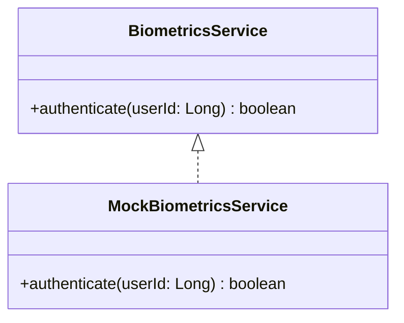

# Hierarchy Diagram

This diagram represents the inheritance and implementation hierarchies
identified in the preliminary analysis of LEANDCORE.

The current hierarchy corresponds to the biometric service, where
`MockBiometricsService` provides an alternative implementation of
`BiometricsService` for testing purposes.

