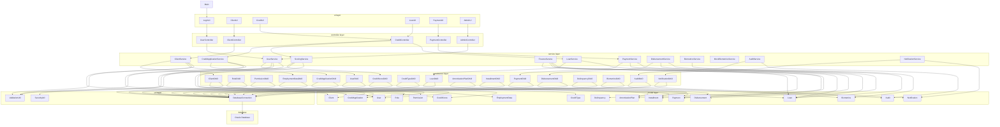

# Layers Diagram

This diagram represents the architectural layers of LEANDCORE
and the allowed dependencies between them.

```mermaid
graph TD

    Main["Main"]

    subgraph UI["ui layer"]
        LoginUI["LoginUI"]
        ClientUI["ClientUI"]
        CreditUI["CreditUI"]
        LoanUI["LoanUI"]
        PaymentUI["PaymentUI"]
        AdminUI["AdminUI"]
    end

    subgraph CONTROLLER["controller layer"]
        UserController["UserController"]
        ClientController["ClientController"]
        CreditController["CreditController"]
        PaymentController["PaymentController"]
        AdminController["AdminController"]
    end

    subgraph SERVICE["service layer"]
        UserService["UserService"]
        ClientService["ClientService"]
        CreditApplicationService["CreditApplicationService"]
        ScoringService["ScoringService"]
        FinanceService["FinanceService"]
        LoanService["LoanService"]
        PaymentService["PaymentService"]
        DisbursementService["DisbursementService"]
        BiometricsService["BiometricsService"]
        MockBiometricsService["MockBiometricsService"]
        AuditService["AuditService"]
        NotificationService["NotificationService"]
    end

    subgraph PERSISTENCE["persistence layer"]
        UserDAO["UserDAO"]
        RoleDAO["RoleDAO"]
        PermissionDAO["PermissionDAO"]
        ClientDAO["ClientDAO"]
        EmploymentDataDAO["EmploymentDataDAO"]
        CreditApplicationDAO["CreditApplicationDAO"]
        CreditScoreDAO["CreditScoreDAO"]
        CreditTypeDAO["CreditTypeDAO"]
        LoanDAO["LoanDAO"]
        AmortizationPlanDAO["AmortizationPlanDAO"]
        InstallmentDAO["InstallmentDAO"]
        PaymentDAO["PaymentDAO"]
        DisbursementDAO["DisbursementDAO"]
        DelinquencyDAO["DelinquencyDAO"]
        BiometricsDAO["BiometricsDAO"]
        AuditDAO["AuditDAO"]
        NotificationDAO["NotificationDAO"]
    end

    subgraph MODEL["model layer"]
        User["User"]
        Role["Role"]
        Permission["Permission"]
        Client["Client"]
        EmploymentData["EmploymentData"]
        CreditApplication["CreditApplication"]
        CreditScore["CreditScore"]
        CreditType["CreditType"]
        Loan["Loan"]
        AmortizationPlan["AmortizationPlan"]
        Installment["Installment"]
        Payment["Payment"]
        Disbursement["Disbursement"]
        Delinquency["Delinquency"]
        Biometrics["Biometrics"]
        Audit["Audit"]
        Notification["Notification"]
    end

    subgraph UTIL["util layer"]
        DatabaseConnection["DatabaseConnection"]
        ValidationUtil["ValidationUtil"]
        SecurityUtil["SecurityUtil"]
    end

    subgraph DATABASE["database"]
        Oracle["Oracle Database"]
    end

    %% ===== MAIN TO UI =====

    Main --> LoginUI

    %% ===== UI TO CONTROLLER =====

    LoginUI --> UserController
    ClientUI --> ClientController
    CreditUI --> CreditController
    LoanUI --> CreditController
    PaymentUI --> PaymentController
    AdminUI --> AdminController

    %% ===== CONTROLLER TO SERVICE =====

    UserController --> UserService
    ClientController --> ClientService

    CreditController --> CreditApplicationService
    CreditController --> ScoringService
    CreditController --> LoanService

    PaymentController --> PaymentService

    AdminController --> UserService

    %% ===== SERVICE TO PERSISTENCE =====

    UserService --> UserDAO

    ClientService --> ClientDAO
    ClientService --> EmploymentDataDAO

    CreditApplicationService --> CreditApplicationDAO

    ScoringService --> CreditScoreDAO

    LoanService --> LoanDAO

    PaymentService --> PaymentDAO

    DisbursementService --> DisbursementDAO

    AuditService --> AuditDAO

    NotificationService --> NotificationDAO

    %% ===== SERVICE TO MODEL =====

    UserService --> User
    ClientService --> Client
    CreditApplicationService --> CreditApplication
    ScoringService --> CreditScore
    ScoringService --> CreditApplication
    FinanceService --> Loan
    FinanceService --> AmortizationPlan
    FinanceService --> Installment
    FinanceService --> Payment
    LoanService --> Loan
    PaymentService --> Payment
    PaymentService --> Loan
    DisbursementService --> Disbursement
    DisbursementService --> Loan
    BiometricsService --> Biometrics
    AuditService --> Audit
    NotificationService --> Notification

    %% ===== PERSISTENCE TO MODEL =====

    UserDAO --> User
    RoleDAO --> Role
    PermissionDAO --> Permission
    ClientDAO --> Client
    EmploymentDataDAO --> EmploymentData
    CreditApplicationDAO --> CreditApplication
    CreditScoreDAO --> CreditScore
    CreditTypeDAO --> CreditType
    LoanDAO --> Loan
    AmortizationPlanDAO --> AmortizationPlan
    InstallmentDAO --> Installment
    PaymentDAO --> Payment
    DisbursementDAO --> Disbursement
    DelinquencyDAO --> Delinquency
    BiometricsDAO --> Biometrics
    AuditDAO --> Audit
    NotificationDAO --> Notification

    %% ===== SERVICE TO UTIL =====

    UserService --> ValidationUtil
    UserService --> SecurityUtil
    ClientService --> ValidationUtil
    CreditApplicationService --> ValidationUtil

    %% ===== PERSISTENCE TO UTIL =====

    UserDAO --> DatabaseConnection
    RoleDAO --> DatabaseConnection
    PermissionDAO --> DatabaseConnection
    ClientDAO --> DatabaseConnection
    EmploymentDataDAO --> DatabaseConnection
    CreditApplicationDAO --> DatabaseConnection
    CreditScoreDAO --> DatabaseConnection
    CreditTypeDAO --> DatabaseConnection
    LoanDAO --> DatabaseConnection
    AmortizationPlanDAO --> DatabaseConnection
    InstallmentDAO --> DatabaseConnection
    PaymentDAO --> DatabaseConnection
    DisbursementDAO --> DatabaseConnection
    DelinquencyDAO --> DatabaseConnection
    BiometricsDAO --> DatabaseConnection
    AuditDAO --> DatabaseConnection
    NotificationDAO --> DatabaseConnection

    %% ===== UTIL TO DATABASE =====

    DatabaseConnection --> Oracle
```